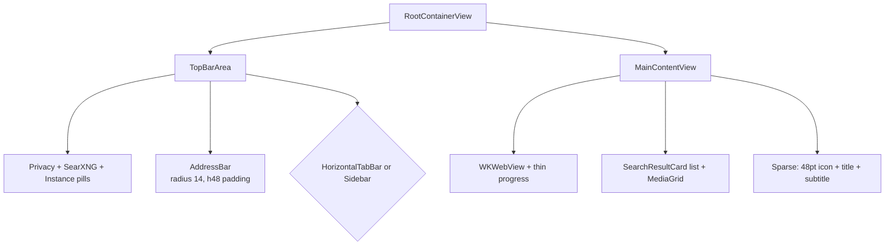

# Searxly Premium Dark/Grey Design System Elevation

**Author:** Grok (Systems Architect, delegated subagent)  
**Date:** 2026-05-27  
**Status:** Draft (Round 1)  
**Version:** 1.0  
**Target:** macOS 15+/26+ SwiftUI + WebKit native app (Searxly)  
**Related:** SEARCXLY-PLAN (implicit), existing Onboarding philosophy, PrivacyManager, LocalSearxngManager

---

## Overview

Searxly is a privacy-first native macOS browser powered exclusively by user-controlled local or private SearXNG instances (no public third-party fallbacks). The systems, tab model (`BrowserTab` + `WebViewFactory`), persistence (`Persistence.swift`), privacy controls (`PrivacyManager.swift`), and multi-instance architecture (`SearXNGService.swift`) are solid and production-leaning. (Smart local suggestions / SearchSuggestionsEngine removed.)

The current UI is a competent, modern "Liquid Glass" implementation (heavy use of `.glassEffect(.regular.interactive())`, `.ultraThinMaterial`/`regularMaterial`, thin white-opacity borders, and SF Symbols) but lacks the intentional luxury, visual cohesion, breathing room, and signature product identity that make apps like Arc, Raycast, or refined tools feel expensive and calm.

This document defines a complete, actionable upgrade to a **premium, luxurious, cohesive dark/grey aesthetic** that:
- Extends (does not replace) the existing Liquid Glass foundation and the `reduceLiquidGlass` @AppStorage toggle (ContentView.swift:22, 97-98, TopBarArea.swift:17 etc.).
- Centers the committed "S E A R X L Y" SPACEX-style logo (spaced all-caps, bold condensed/futuristic sans, precise tracking) as the signature brand moment exclusively on the home/new-tab state.
- Delivers "that premium feel" through a real design system (tokens for color, type, spacing, radius, glass/elevation, motion), refined home state, elevated components, richer-but-restrained micro-interactions, thoughtful hierarchy, and subtle restrained cosmic/privacy motifs echoing the excellent `StarfieldBackground` (OnboardingView.swift:801+).

The result: calm, tech-forward, privacy-respecting luxury that feels intentional and expensive while remaining 100% native SwiftUI and fully respectful of accessibility/performance preferences.

---

## Background & Motivation

**Current state (verified via full codebase exploration):**
- **Root layout (in-progress extraction, advanced by monster refactor):** ContentView.swift is now thin orchestration (state moved to BrowserState.swift). RootContainerView etc remain legacy/unwired. (See refactor plan and BrowserState for current architecture.)
- **AddressBar** (ContentView.swift:619-884): glassy `RoundedRectangle(cornerRadius: 14)`, `.padding(.horizontal, 16)` inside, outer container `.padding(.horizontal, 48)` + `.padding(.top, 16)` (TopBarArea.swift:138-139). Hybrid suggestions with section headers (font size 10 semibold), rows at 13.5pt/10.5pt. Focus ring `Color.white.opacity(0.18)`, shadow.
- **Home/New Tab** (MainContentView.swift:229-244): Extremely minimal `VStack(spacing: 16)` with 48pt SF "magnifyingglass", "Private Search Ready" `.title3.weight(.semibold)`, one-line subtitle. No branding, no visual weight, feels sparse/empty. Triggered when `!showingWebContent && searchResults.isEmpty`.
- **Search results:** `SearchResultCard` (ContentView.swift:933-1064) uses flat `Color.primary.opacity(0.045)` hover only, 16.5pt semibold titles, engine pill, security URL, snippet. Category capsules use `.thinMaterial`/`ultraThinMaterial` + thin glass. Media via `SearchMediaGrid`/`MediaGridItem` with spring(0.26) scale + shadow hovers.
- **Tabs:** `TabButton` (TabButton.swift:47-97) has good scale 1.02 on select + 0.12 ease animation, 11pt radius glass pills in horizontal; sidebar is simpler. `HorizontalTabBar` re-uses 48pt horizontal padding.
- **Glass & materials:** Ubiquitous in `RightToolbarControls.swift`, `TopBarArea.swift:59-60`, `TabButton.swift:81`, suggestions dropdown, sheets (`.regularMaterial` headers + footers in SettingsView, ClearBrowsingDataView, MediaPreviewSheet, etc.). Computed `toolbarMaterial` and `glassEnabled` (ContentView.swift:97-98) centralize the reduce toggle.
- **Premium seeds:** Outstanding `StarfieldBackground` Canvas (drifting + probabilistic shooting stars, OnboardingView.swift:801-980, 140 stars, ~0.8s timer) on full black + 0.88 overlay. Good FaviconView monograms (6pt radius fallback), TabButton scale/hover, some spring animations in media grid. Onboarding is philosophically strong with green privacy tints.
- **Colors:** Heavy reliance on system `.primary`/`.secondary`/`.tertiary` + `.opacity(0.04-0.22)` whites for glass edges + ad-hoc `.green` for privacy/SearXNG status. `AccentColor.colorset` is empty (system default). `AppearanceMode` enum exists (system/light/dark) but UI is dark-optimized.
- **Other sheets:** `BookmarksHistoryView`, `DownloadsSheetView`, `KeyboardShortcutsView`, `AboutView` (basic), `MediaPreviewSheet` (in SearchImageGrid.swift:221+) all follow the same material + thin stroke pattern. No strong typography or spacing system.
- **Pain points (premium gap):** Sparse home (user request), inconsistent breathing room (48pt vs 8-16pt paddings), ad-hoc opacities instead of tokens, weak brand identity (no logo, generic "Searxly" text), hover states are functional but not luxurious, results feel list-like rather than elevated cards, loading/error states are utilitarian, motion is present but not curated, typography mixes system sizes without hierarchy discipline. Feels "good modern SwiftUI" rather than "refined expensive tool."

**Why now:** The engineering foundation (Phases 1-15+) is mature. Elevating the aesthetic creates emotional ownership, reinforces the "beautiful, privacy-respecting" positioning (README.md), and differentiates in the native macOS privacy-tool space without compromising the core privacy model.

---

## Goals & Non-Goals

**Goals**
- Deliver a cohesive "Searxly Dark" grey-scale palette (near-blacks #0A0A0C to sophisticated greys #3A3A40, excellent contrast) that works beautifully with materials and the reduce-glass toggle.
- Establish a real, documented design system (tokens + modifiers) for color, type (refined sizes/weights), spacing (4pt/8pt), radius (6-20pt), glass/elevation levels, and motion (restrained durations/curves).
- Implement the committed SPACEX-style "S E A R X L Y" logo (precise letter spacing/tracking, bold condensed sans) top-center directly above the main AddressBar **only** on home/new-tab (`!showingWebContent && searchResults.isEmpty`).
- Elevate every major surface: home, AddressBar + suggestions, result cards (list + media), tabs (horizontal + sidebar), toolbars, sheets, loading/error states.
- Richer micro-interactions and depth (subtle shadows, refined hovers, purposeful animations) while keeping total motion low and calm.
- Preserve 100% compatibility with `reduceLiquidGlass` (all premium details degrade gracefully to solid/less-blur variants).
- Maintain extreme privacy invariants (no change to `PrivacyManager`, `WebViewFactory`, ephemeral tabs, local-only suggestions, instance model).

**Non-Goals**
- Full custom chrome or ripping out Liquid Glass / materials.
- Light theme overhaul or heavy skeuomorphism.
- Introducing public instances, external tracking, or any privacy regression.
- Heavy cosmic/starfield motifs everywhere (restrained, home-only or very subtle accents only).
- New major features (e.g. extensions, sync); this is pure aesthetic/system elevation.
- Changing the local SearXNG management surface or onboarding flow structure (align only where needed for visual consistency).
- Asset-heavy custom fonts (prefer system + kerning/attributed or minimal SF Symbols extensions).

**Quantitative Targets**
- Home visual weight: logo + tagline + subtle affordance within 180-220pt vertical centered zone (responsive to window height).
- AddressBar padding remains 48pt horizontal for consistency with tabs; logo respects this center line.
- Hover transition: 120-180ms max.
- Result card elevation delta: noticeable but not flashy (0.04-0.08 opacity + 4-8pt shadow on hover).
- Maintain minWidth 900 / minHeight 600.

---

## Proposed Design

### 1. Design System Foundations (New: `DesignSystem/` or single `DesignTokens.swift` + `View+Premium.swift`)

Introduce a single source of truth. All existing ad-hoc values migrate here.

**Color Tokens (Searxly Dark palette – primary dark/grey focus)**
```swift
// In DesignTokens.swift
enum SLColor {
    // Base greys (near-black to mid)
    static let bgBase = Color(hex: "#0D0D10")      // Root / deepest
    static let bgElev1 = Color(hex: "#141418")     // Cards, suggestions base
    static let bgElev2 = Color(hex: "#1C1C22")     // Elevated sheets
    static let surface = Color(hex: "#222228")     // Subtle surfaces

    // Text & borders (excellent dark contrast)
    static let textPrimary = Color.white
    static let textSecondary = Color.white.opacity(0.72)
    static let textTertiary = Color.white.opacity(0.48)
    static let borderSubtle = Color.white.opacity(0.06)
    static let borderFocus = Color.white.opacity(0.18)
    static let borderGlass = Color.white.opacity(0.10)

    // Privacy / accent (keep existing green strength + refined luxe accent)
    static let privacyGreen = Color(hex: "#22C55E")   // Existing shield strength
    static let luxeAccent = Color(hex: "#8B9CB3")     // Cool grey-blue for non-privacy highlights
    static let warningOrange = Color(hex: "#F59E0B")  // Used sparingly

    // Hover / active states (layered on materials)
    static let hoverOverlay = Color.white.opacity(0.045)
    static let activeOverlay = Color.white.opacity(0.08)
}
```
Materials remain the primary "glass" layer; tokens provide the precise overlays/borders that make glass feel expensive.

**Typography Scale (refined, consistent)**
- Display/Logo: 28-34pt, weight .black/.heavy, design .default or condensed, tracking +4 to +8 (kerning)
- Title1: 28pt semibold
- Title2 / Title3: 20-22pt / 17-19pt semibold (rounded where calm)
- Headline: 15-16pt semibold
- Body / Result title: 15.5-16.5pt regular/semibold
- Callout / Secondary: 13-14pt
- Caption / Small: 11-12pt / 10pt semibold for headers
- Monospace for URLs where needed: system(size: 11, design: .monospaced)

All via `.font(.system(size: X, weight: W, design: .rounded))` for premium rounded soul where appropriate (logo, headings).

**Spacing Scale (8pt base, 4pt increments for precision)**
`slSpacing1 = 4`, `2=8`, `3=12`, `4=16`, `5=20`, `6=24`, `8=32`, `12=48` (preserve existing 48pt for AddressBar/tab alignment).

**Radius Scale**
`slRadiusS=6`, `M=8`, `L=10`, `XL=12`, `XXL=14`, `Pill=999` (or 20 for larger).

**Glass / Elevation Tokens**
```swift
enum SLGlass {
    static let pillRadius: CGFloat = 14
    static let cardRadius: CGFloat = 12
    static let tabRadius: CGFloat = 11
    static let focusBorderWidth: CGFloat = 1.2
    static let subtleBorderWidth: CGFloat = 0.6
}
```
Modifiers:
```swift
extension View {
    func slPremiumGlass(enabled: Bool, radius: CGFloat = SLGlass.pillRadius, level: SLGlassLevel = .regular) -> some View { ... }
    func slHoverLift(isHovering: Bool) -> some View { ... }  // scale + shadow + overlay
    func slFocusRing(isFocused: Bool) -> some View { ... }
}
```
These wrap existing `.glassEffect(...)` + `.background(..., in: RoundedRectangle...)` + overlay stroke + shadow patterns.

**Motion Tokens (restrained – "expensive calm", not busy)**
- Hover / micro: `.easeOut(duration: 0.12)` or `.easeInOut(0.10)`
- Card lift / result: `.spring(response: 0.28, dampingFraction: 0.82)`
- Tab select: existing 0.12 + slight scale 1.015 (reduce from 1.02 to calmer)
- Logo / home entrance: `.easeOut(duration: 0.35)`
- No animation on static text or frequent state (e.g. typing in AddressBar suggestions uses opacity only).
- Reduce toggle must also disable higher-cost animations (e.g. starfield twinkle, complex springs).

**Logo Spec (committed "S E A R X L Y")**
- All-caps spaced letters: "S E A R X L Y" (single spaces between each character).
- Font: Bold condensed sans (`.system(size: 32, weight: .black, design: .default)` or SF Pro Display Condensed Bold equivalent via size/weight/kerning).
- Tracking: `.kerning(6.0)` or per-letter HStack with fixed spacing 18-22pt between centers for precise futuristic weight (recommended custom `SearxlyLogo` view using `HStack(spacing: 0)` + individual `Text` with padding or attributed string for exact control).

**Minimal SearxlyLogo stub (recommended starting implementation for PR 2):**
```swift
struct SearxlyLogo: View {
    var body: some View {
        HStack(spacing: 0) {
            ForEach(Array("S E A R X L Y".split(separator: " ")), id: \.self) { letter in
                Text(String(letter))
                    .font(.system(size: 32, weight: .black, design: .default))
                    .kerning(0)   // control via explicit spacing below if needed
                    .foregroundStyle(SLColor.textPrimary)
            }
        }
        .padding(.horizontal, 4)   // fine-tune outer margins
    }
}
// For even tighter control, replace the ForEach body with individual Text views
// having explicit .padding(.trailing, 19) (or .leading) between letters and measure
// center-to-center distance in a preview against SF Pro metrics.
```

- Color: `SLColor.textPrimary` with subtle gradient or solid + very faint luxe accent underline/glow (optional, behind reduce-glass).
- Placement: **Top-center directly above main AddressBar** on home only. Horizontal alignment matches AddressBar center (respects 48pt outer padding). Vertical: generous breathing ~72-96pt above AddressBar top when home. Subtle fade-in on home state entry.
- Responsive: Scale down slightly on very narrow windows; never collides with left badges or right toolbar.
- Tagline (optional but recommended): "Private. Yours." in 12pt tertiary, 8pt below logo, same center.

**Implementation Notes for Logo + Home State (Critical for Unambiguous Handoff)**
The logo must render *above* the AddressBar (in the vertical flow of TopBarArea) but the home condition (`!showingWebContent && searchResults.isEmpty`) and the placeholder content live exclusively inside MainContentView.swift (the final `else` of its Group). TopBarArea.swift currently receives only `showingWebContent` (not `searchResults` or a derived flag) and owns the AddressBar instantiation + its outer `.padding(.horizontal, 48).padding(.top, 16)`.

**Recommended data-flow (minimal lift, no architecture change):**
1. In `ContentView.swift`, add a computed property (or `@State` derived in onChange):
   ```swift
   private var isHomeState: Bool {
       !showingWebContent && searchResults.isEmpty && !isLoadingSearch
   }
   ```
2. Pass `isHomeState` explicitly as a new `let` parameter to `TopBarArea(...)` (and through `RootContainerView` if wired).
3. In `TopBarArea`, add the parameter to the struct and render the logo *conditionally* in the VStack immediately before the AddressBar instantiation (inside the same padding context or a dedicated wrapper that preserves the 48pt horizontal alignment). Example sketch:
   ```swift
   if isHomeState {
       SearxlyLogo()
           .padding(.top, 72)   // generous breathing; tune with 48pt sacred alignment
           .padding(.bottom, 8)
           .frame(maxWidth: .infinity, alignment: .center)
   }
   AddressBar(...)
       .padding(.horizontal, 48)
       .padding(.top, 16)
   ```
4. Keep the rest of the home placeholder (or remove it) in MainContentView; the logo + motif live in the TopBarArea vertical stack for correct visual stacking above the glassy pill. Pass `glassEnabled` (already present) to the logo/motif for reduce toggle.
5. The logo view must never affect left badge row or right toolbar layout (use Spacer + center alignment; test narrow windows <900pt).
6. If RootContainerView is wired during this work, the flag simply flows through the existing forwarding.

Alternative (if preferred): Move the entire home hero treatment (logo + AddressBar + motif) into a new `HomeTopChrome` view composed inside TopBarArea when `isHomeState`. Either approach is acceptable; the explicit `isHomeState` lift is the key requirement.

This removes all ambiguity for the PR 2 implementer.

**Home Page Treatment (MainContentView + conditional in TopBarArea or lifted state)**
- When `!showingWebContent && searchResults.isEmpty`:
  - Replace or augment the current sparse placeholder with:
    1. `SearxlyLogo()` (prominent, centered).
    2. Optional refined tagline.
    3. The existing AddressBar (unchanged position/padding).
    4. Very restrained background motif: low-opacity (0.03-0.06) drifting micro-stars or dots using a lightweight, toggleable variant of `StarfieldBackground` (or a static subtle pattern via Canvas at 5-8% opacity) **only** in the home content area below the toolbar. Disabled when `reduceLiquidGlass`.
  - Quick actions (future-friendly, deferred): 3-4 very subtle pill buttons below AddressBar ("Recent", "Bookmarks", "New Private Tab") using the same glass language, small. **Default for initial PR 2**: logo + optional tagline only (see Open Questions #2). Keep the vertical zone target 180-220pt.
- The 48pt horizontal padding on AddressBar and tabs remains sacred for visual alignment.
- Result: the address bar becomes the hero with the brand signature floating elegantly above it.

**Home Motif Implementation Sketch (Lightweight, Reduce-Glass Safe)**
The motif reuses the proven `StarfieldBackground` logic (OnboardingView.swift:801-975: TimelineView + Canvas, drifting stars via time-based yOffset + sin wobble, probabilistic shooting stars, twinkle via sin, 140 stars, 0.8s Timer) but must be drastically lighter for the persistent home state and must tie directly to the existing `glassEnabled` computed property.

Recommended concrete implementation (`HomeStarfieldMotif` view, placed in the home content area of MainContentView or as background to the logo zone in TopBarArea):

```swift
struct HomeStarfieldMotif: View {
    let glassEnabled: Bool   // from parent; false when reduceLiquidGlass
    @State private var stars: [Star] = []

    var body: some View {
        if glassEnabled {
            TimelineView(.animation) { timeline in
                Canvas { context, size in
                    // ... (reuse exact drifting math from StarfieldBackground)
                    // Key reductions for perf:
                    let count = 24   // down from 140
                    // No shooting stars at all in motif (remove the entire activeShootingStars block + spawn timer)
                    // Lower frequency / simpler twinkle
                    // Opacity clamped: .white.opacity(0.03...0.055)
                }
            }
            .opacity(0.045)
            .allowsHitTesting(false)
        } else {
            // Static ultra-low-cost fallback (pure dots, no animation)
            Canvas { context, size in
                for i in 0..<18 {
                    let x = size.width * CGFloat((i * 37) % 97) / 100.0
                    let y = size.height * CGFloat((i * 61) % 83) / 100.0
                    context.fill(Path(ellipseIn: CGRect(x: x, y: y, width: 1.2, height: 1.2)),
                                 with: .color(.white.opacity(0.025)))
                }
            }
            .opacity(0.04)
        }
    }
}
```

- Disable entirely when `!glassEnabled` (already the contract).
- No Timer.publish or shooting-star logic in the motif variant.
- Performance: Target <2% CPU on M1/M2 when visible (measure with Instruments in PR 4 or 7 before shipping the Canvas path).
- Placement: ZStack background behind the centered logo + AddressBar in the home treatment; clipped to safe area.

This gives the implementer a zero-ambiguity starting point while leaving final star count / exact opacity as a tunable constant.

**Mermaid: Current High-Level UI Flow (simplified)**


**Proposed (with Brand Layer)**
```mermaid
graph TD
    Root --> Top
    Top --> Badges
    Top --> Addr
    Top --> Tabs
    Root --> Main
    Main --> Web
    Main --> Results
    Main --> Home
    Home --> Logo["SearxlyLogo<br/>'S E A R X L Y'<br/>kerning + tagline"]
    Home -.-> "Subtle restrained<br/>Starfield (home-only,<br/>respect reduceGlass)"
    Addr -. "Same 48pt alignment" .-> Logo
```

**Component-by-Component Upgrades (citing files/lines)**

- **AddressBar + Suggestions** (ContentView.swift:692-884, TopBarArea.swift:128-139): Increase inner vertical padding slightly for luxury (12-13pt). Stronger focus ring + multi-layer shadow on focus. Suggestions: consistent use of `SLColor` tokens, better section header typography (11pt semibold), refined row hover (use new `slHoverLift`), keep 9-result cap. Add subtle "powered by your private SearXNG" footer line in empty state.
- **SearchResultCard** (ContentView.swift:933+): Upgrade from flat hover to true elevated card with `SLGlass.cardRadius=12`, subtle border, lift on hover (scale 1.005 + shadow 0-8pt), richer security treatment (lock always visible, color via tokens). Engine pill uses luxeAccent when hovering. Snippet line clamp with elegant fade.
- **Media Grid Items** (SearchImageGrid.swift:161+): Already good spring animation – refine shadow color to use tokens, ensure consistent radius 12, add premium overlay gradient on hover for "expensive photo" feel.
- **TabButton / HorizontalTabBar** (TabButton.swift:47-97, HorizontalTabBar.swift:28+): Calm scale 1.015 max. Add subtle privacy shield color treatment (green tint on private tabs). Sidebar remains compact but gains consistent token borders.
- **RightToolbarControls & Top toolbar badges** (RightToolbarControls.swift:38+, TopBarArea.swift:49-106): Standardize all circular buttons to a single `SLButtonStyle.circularGlass` modifier. SearXNG status pill gets better status color mapping via tokens.
- **Sheets (Settings, BookmarksHistory, MediaPreview, Clear, Downloads, About, KeyboardShortcuts)**: Consistent header/footer `.regularMaterial` bars with 14pt padding + 12pt radius cards inside. Use design tokens for all text and dividers. AboutView (AboutView.swift:13+) gets logo treatment and refined typography.
- **Loading / Error states** (MainContentView.swift:70-228): Replace utilitarian ProgressView with elegant centered spinner using luxeAccent. Error gets illustrated state + direct "Open Settings" CTA using primary button style.
- **Onboarding alignment** (OnboardingView.swift): Minor – ensure step cards use new radius/ tokens; keep starfield as-is (it is already premium).
- **FaviconView** (FaviconView.swift): Already excellent – extend monogram to use `SLColor` quaternary with better contrast.

**Motion & Interaction Spec**
- Animate: hover lifts, tab selection scale + shadow, suggestion dropdown slide+opacity, logo entrance, result card lift, focus ring expansion.
- Do **not** animate: every keystroke in AddressBar (only show/hide dropdown), static result list re-renders, tab title updates.
- ReduceLiquidGlass must short-circuit springs to linear 0.08s and disable Canvas starfield entirely.

**Reduce Liquid Glass Compatibility**
All new premium layers (extra borders, shadows, logo treatments, subtle motifs) are guarded:
```swift
if glassEnabled {
    .glassEffect(...)
    .overlay( ... SL border ... )
    .shadow(...)
} else {
    .background(SLColor.bgElev1)
    .overlay( thinner solid border )
}
```
Home starfield motif becomes a static very-low-opacity dot pattern when reduced.

**Dark/Grey Focus**
Palette above is the definition of "Searxly Dark". Light mode (if used) falls back to system with minimal token overrides. No bright accents except privacy green.

---

## API / Interface Changes

**New public API (internal module):**
- `DesignTokens.swift` (or `SLDesign` namespace)
- View modifiers: `.slPremiumGlass(...)`, `.slCard(elevated: Bool)`, `.slLogoStyle()`, `.slHomeContainer()`
- `SearxlyLogo` view (reusable, size-scalable)
- Environment or AppStorage for future "enhancedPolish" (initially tied to `!reduceLiquidGlass`)

No public API surface changes for users or external consumers. Sheets and sheets APIs remain identical.

**Before/After Example (AddressBar focus ring):**
```swift
// Before (ContentView.swift:746-751)
.overlay( RoundedRectangle... .strokeBorder( isFocused ? Color.white.opacity(0.18) : ... ) )

// After
.slFocusRing(isFocused: isFocused)
```

---

## Data Model Changes

**None required.**  
This is a pure presentation / design system layer. Existing models (`BrowserTab`, `SearXNGResult`, `HistoryItem`, etc.) are untouched. Persistence and privacy contracts unchanged.

Optional future (non-goal for this effort): Persist one design preference flag if a separate "Premium Polish" toggle is added later.

---

## Alternatives Considered

**1. Full custom chrome (remove materials, draw everything with Canvas/Shape)**
- Pros: Total visual control, easier "expensive" details.
- Cons: Breaks the "native macOS 15+/26+ Liquid Glass" promise, destroys the reduce toggle, high maintenance, accessibility risk, feels non-native.
- **Decision:** Rejected. Enhance native instead.

**2. Heavy cosmic / starfield motifs throughout the entire app (home + results + tabs)**
- Pros: Strong brand link to onboarding.
- Cons: Visually busy, conflicts with calm/privacy philosophy, performance cost on every screen, dilutes focus on content.
- **Decision:** Restrained to home only + very low opacity optional motif. Starfield code is reused lightly.

**3. Minimal "just add the logo" approach**
- Pros: Fast.
- Cons: Does not deliver "truly premium, luxurious, cohesive" experience; leaves ad-hoc colors, inconsistent spacing, weak hierarchy.
- **Decision:** Rejected in favor of full design system + component elevation.

**4. Introduce a separate "Luxe" accent color toggle or heavy custom font asset**
- Pros: Flexibility.
- Cons: Scope creep, asset burden, maintenance.
- **Decision:** Single luxe grey-blue accent derived from palette; system fonts + kerning only.

---

## Security & Privacy Considerations

- **No impact** on core privacy model: searches still only to user instances, private tabs fully ephemeral (`WebViewFactory.swift:73-83`), local-only suggestions, encrypted option via `EncryptedDataStore`.
- Design system adds zero network calls or data exfiltration.
- Logo and motifs are pure local rendering.
- Threat model unchanged: local data (history, learned suggestions) still governed by `PrivacyManager` and user toggles.
- Accessibility: All new motion and glass layers respect `reduceLiquidGlass`; high-contrast text tokens maintain WCAG in dark.

---

## Observability

- **Minimal.** No new telemetry.
- During development: optional `#if DEBUG` logging of animation durations or measured home layout via `onAppear` prints (removed before merge).
- Production: rely on existing SwiftUI performance tools + Instruments for Canvas cost of optional home motif (guard with feature flag during rollout).
- Alerting: None needed (pure UI).

---

## Rollout Plan

**Phased, independently reviewable PRs (see PR Plan below).** All behind the existing `reduceLiquidGlass` path for safety.

1. **Foundation PR** (tokens + modifiers) – zero visual change until later PRs adopt them.
2. **Home + Logo** – gated behind a new internal `@AppStorage("searxlyPremiumHome")` (default true after first run) or simply always-on once tokens land.
3. **Component polish** – incremental (results, then tabs, then sheets).
4. **Full adoption** – remove old ad-hoc values.

**Feature flag strategy:** Start with the existing `glassEnabled`. Any future "enhancedPolish" flag (unlikely for this effort) would be internal-only and would not introduce a new user-facing persisted preference in PR 8.

**Staged rollout:**
- Internal / self-dogfood first.
- Merge PRs sequentially with design review on each.
- Post-merge: lightweight "Enhanced visual polish" note only in SettingsView.swift Appearance section (and README). This note is purely documentary / future-proofing and **initially derives directly from `!reduceLiquidGlass`** (no new @AppStorage key or persisted preference added in PR 8). A real toggle surface is explicitly non-goal for this round and would only be introduced later if a genuine A/B or accessibility experiment requires it. See Issue 6 clarification.

**Rollback:** Revert single PR or flip the reduce toggle (immediate). No data migration.

---

## Key Decisions & Rationale

- **Extend Liquid Glass, don't replace it**: Preserves the "modern native" identity and the accessibility investment already made.
- **Home-only logo + restrained motif**: Maximizes brand impact where it matters most (first impression) without polluting web/results experiences.
- **4pt/8pt spacing + explicit token file**: Eliminates the current ad-hoc 4/6/8/11/12/14/16/48 drift.
- **Green stays for privacy signals only**: Luxe accent is cool grey so privacy remains the emotional highlight.
- **Kerning-based logo (no custom font asset initially)**: Lowest friction, highest fidelity control, matches "native first" philosophy.

---

## Open Questions

1. Exact logo typography/kerning details (pure `.kerning(6.0)` on single Text vs. letter-by-letter HStack with explicit spacing 18-22pt between centers for pixel-perfect control)? Data-flow and placement (isHomeState lift + rendering in TopBarArea) are now fully specified in "Implementation Notes for Logo + Home State". (Recommendation: letter HStack for control.)
2. Should the home state include 3-4 quick-action pills below the AddressBar (e.g. "Bookmarks", "New Private Tab")? Scope + copy needed. (Default for PR 2: logo + optional tagline only; defer pills.)
3. Tagline under logo: "Private. Yours." vs. "Searches that belong to you." vs. none? User preference. (Default for PR 2: include "Private. Yours." at 12pt tertiary.)
4. Performance budget for the restrained home starfield motif on lower-end Macs (M1/M2)? Measure FPS in Instruments before finalizing Canvas variant.
5. Do we want a very subtle "cosmic dot grid" static background asset or pure Canvas for the home motif?
6. Future: Should the logo appear (smaller, monochrome) in the About window and/or Settings header for consistency?

---

## PR Plan (8 Small, Independently Reviewable PRs – Logical Order)

1. **PR 1: Design Tokens & Modifiers**  
   Files: New `DesignSystem/DesignTokens.swift`, `View+SLPremium.swift` (or Components/). Update `ContentView.swift` (computed helpers), `Models.swift` (optional enum exposure).  
   Desc: Define all SLColor, spacing, radius, glass, motion tokens + reusable modifiers. Zero visual change. Tests: snapshot or manual dark mode review.
   - Optional hygiene sub-task: wire `RootContainerView.swift` (currently unwired extraction mirror) into the `contentWithDataSheets` composition site in ContentView.swift for centralized forwarding of `glassEnabled` + future `isHomeState`. Low-risk; improves extraction hygiene ahead of PR 2 logo work. (See transitional note below and Issue 1/3 in review.)

2. **PR 2: Home Page Elevation + Logo Stub**  
   Files: `MainContentView.swift:229+` (replace/augment placeholder), new `Components/SearxlyLogo.swift`, `TopBarArea.swift` (logo rendering + padding), ContentView.swift (isHomeState computation + passing).  
   Desc: Implement "S E A R X L Y" (kerning impl) + tagline, breathing room, optional restrained motif. See new "Implementation Notes for Logo + Home State" subsection (explicit isHomeState lift recommended; logo rendered in TopBarArea above AddressBar). AddressBar 48pt padding unchanged. Depends on PR1. Follow the data-flow sketch exactly to avoid cross-component ambiguity.

3. **PR 3: AddressBar & Suggestions Polish**  
   Files: `ContentView.swift:692-884`, `TopBarArea.swift:128-139`.  
   Desc: Adopt tokens, refined focus/shadow, better section typography, subtle footer. Suggestions rows use new hover modifier.

4. **PR 4: Search Results & Media Grid Elevation**  
   Files: `ContentView.swift:933-1064` (SearchResultCard), `SearchImageGrid.swift` (MediaGridItem + preview sheet).  
   Desc: True elevated cards with lift, consistent radii/borders, token colors, refined hovers.

5. **PR 5: Tabs, Toolbar & Navigation Cohesion**  
   Files: `TabButton.swift`, `HorizontalTabBar.swift`, `RightToolbarControls.swift`, `TopBarArea.swift:49-125`, `SidebarTabList.swift`.  
   Desc: Unified circular glass style, calmer scales, privacy accent treatment, 48pt alignment preserved.

6. **PR 6: Sheets & Secondary Surfaces**  
   Files: All `Views/Features/*.swift` (Settings, About, BookmarksHistory, Clear, Downloads, MediaPreviewSheet, KeyboardShortcuts), `ListItemRow.swift`.  
   Desc: Consistent header/footer treatment, token adoption, refined About with logo.

7. **PR 7: Motion Curate + Reduce Glass Hardening**  
   Files: All files with animation (TabButton, SearchImageGrid, ContentView suggestions, etc.) + central motion helpers.  
   Desc: Replace ad-hoc durations with tokens; ensure reduce toggle disables heavy springs/Canvas; add perf guard.

8. **PR 8: Final Polish, Documentation & Settings Alignment**  
   Files: README.md, SettingsView.swift (Appearance section), any remaining ad-hoc values, Onboarding minor alignment.  
   Desc: Remove old literals, add lightweight "Enhanced visual polish" *note* (purely documentary; derives from existing `!reduceLiquidGlass`, **no new @AppStorage** or persisted preference added). Update screenshots/docs, final dark/grey QA pass. (Addresses non-goal tension on new prefs — see Rollout Plan clarification and Issue 6.)

**Dependencies:** PR1 blocks all. PR2 can land early after 1. PRs 3-7 are parallelizable after 1+2. PR8 last.

**Root layout transitional note (addressing in-progress extraction):** ContentView.swift currently uses direct composition (`contentWithDataSheets` + `topBarAreaView()` helper) while RootContainerView.swift exists as an unwired mirror (prepared for hygiene but not integrated). PR 1 or PR 2 may optionally include a small sub-task to wire RootContainerView (low-risk, centralizes future passing of `glassEnabled` + new `isHomeState`). See Issue 1/3 clarifications in review. This is optional for maintainability and does not block the visual work.

**Risk per PR:** Low (additive, gated by existing toggle). Each PR < ~300 LOC changed where possible.

---

## References

- Apple Human Interface Guidelines: Liquid Glass / Materials (macOS 15+)
- Existing codebase: `OnboardingView.swift:801` (StarfieldBackground as source of truth for cosmic motif), `PrivacyManager.swift`, `WebViewFactory.swift` (SearchSuggestionsEngine removed)
- Prior art: Arc browser (cohesive tabs + address), Raycast (premium dark + instant feel), refined native tools (Craft, Things)
- GitHub project: https://github.com/Myrhex-x/Searxly
- User request: "S E A R X L Y" SPACEX-style logo top-center on home address bar area

---

**End of Design Document v1.0 (Draft)**

*This document is ready for review. All recommendations are concrete, cite exact paths/lines, and are implementable by a senior SwiftUI engineer in the existing architecture.*
